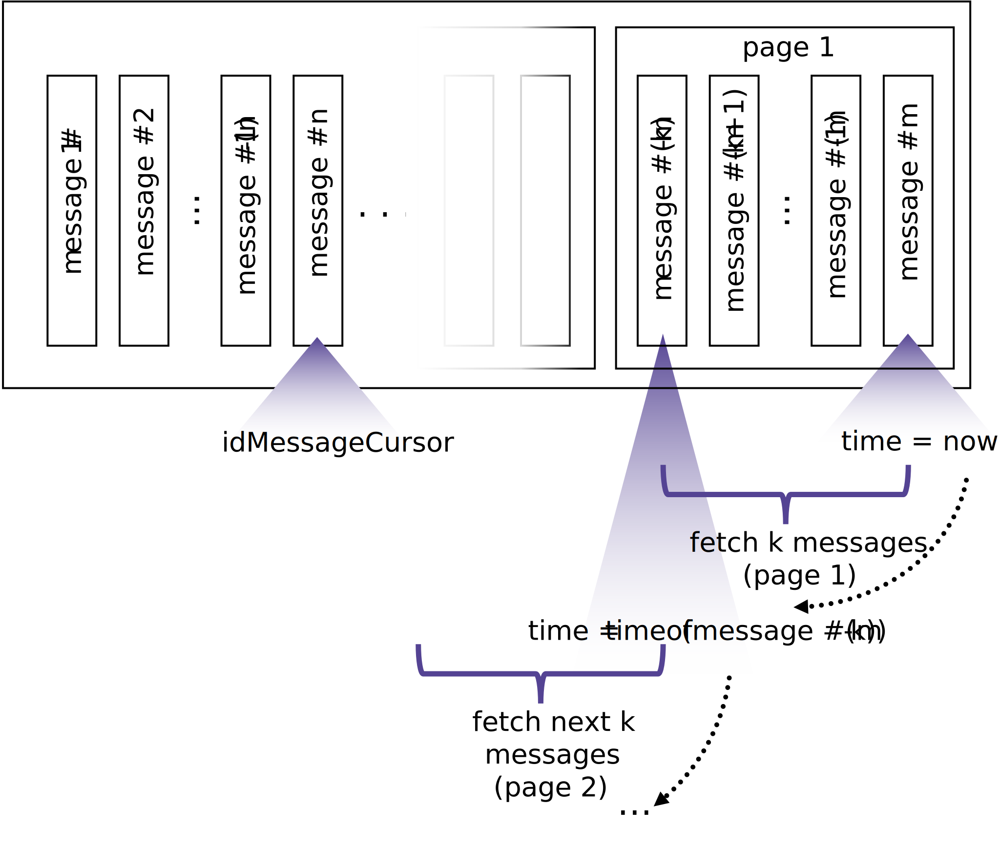

# Billboard Service API

The Billboard Service API provides the functions needed to retrieve the billboard information.

## Retrieve the Billboard Messages

The billboard is a list of statements (messages) from all participants which is ordered by the creation time. Since the number of entries can be very large, the return is paged and only a defined number of results are returned per retrieval.

Each entry consists of

* the identifier,
* the message (statement),
* the time, and
* the address of the creator (sender).

```JavaScript
DEFINITION: BillboardMessage

{
  id: string,
  message: string,
  time: number,
  senderAddress: string,
}
```

### Methode

This method is called to retrieve a block (page) of statements.

```TypeScript
// call to request a number of statements
dm3_billboard_getMessages
```

### Request

The request passes the **identifier** of the billboard and a description which messages must be returned. As messages may be paged, the information must be provided, which messages are already read. So it must be possible to fetch newest messeges first  get the older ones page by page, too.

These parameters must be provided to define which messages should be returned:

* **idBillboard** The **id** of the billboard which messages should be returned.
* **idCurrentMessage** The **id** of the currently newest message. If older messages are fetched, `idCurrentMessage` is the last already fetched message. If `idCurrentMessage` is empty or undefined, the most current message is addressed (means: ).
* **idMessageCursor** The **id** of the newest message of the complete block. If `idMessageCursor` is empty or undefined, no messages are fetched and `idMessageCursor` is zero.

```TypeScript
// the id of the billboard
idBillboard = <id of the requested billboard>
// the id of the message to be start of the current page
//may be empty or undefined
idCurrentMessage? = <id of the newest fetched message>
// the id of the latest message of the (complete) block of messages 
idMessageCursor? = <id of the latest message of the block>
```

If `idCurrentMessage` is empty or undefined, the first page (`k` entries) of the newest messages of the billboard are returned. The viewer can request other pages (backwards) until the `idMessageCursor`is reached (then all messages are fetched). For performance reasons it may be appropriate to only fetch the first page starting with the newest message and additional pages only if needed.

The fetching and paging process is visualized in the graph:


### Response

The list of messages is returned.

```JavaScript
{
  messages: BillboardMessage[],
}
```

> **Example** Billboard Messages:
>
> ```JavaScript
> {
>    "messages": 
>    [
>      {
>         "id":"1",
>         "message":"message 1",
>         "time":16813115520000,
>         "0x12345...cdef"
>      },{
>         "id":"2",
>         "message":"message 2",
>         "time":16813115560000,
>         "0xfEDcbA...321"
>      },
>    ]
> }
> ```

In case of an error, an error object is returned as described in [error codes](#error-codes).

### Websocket connection

Optionally, a websocket connection can established to retrieve updates via the direct connection to the billboard service.
The data from the past are then retrieved and supplemented page by page as needed (such as initialization, scrolling into the past,...).

## Retrieve List of Billboards

One billboard service can host multiple billboards. The list can be queried.

### Methode

This method is called to retrieve the list of available billboards.

```TypeScript
// call to request the list of available billboards
dm3_billboard_list
```

### Response

The list with the ENS-names containing the dm3 profile for each billboard is return.

```JavaScript
{
  billboards: string[],
}
```

> **Example** List of Billboards:
>
> ```JavaScript
> {
>    "billboards": 
>    [
>      "billboard01.billboards.example.eth",
>      "billboard02.billboards.example.eth",
>    ],
> }
> ```

## Retrieve Billboard's Properties

Each billboard is defined by a ENS name providing a **dm3** profile (see [dm3 profile](../message-transport/mtp-registry.md#user-profile)). While this profile contains all information needed for sending messages to the billboard, additinal information and properties can be requested from the billboard service.

* **Name:** The name od the billboard. This name is shown in the billboard message viewer.
* **Mediators:** Mediators have the task of moderating the chat conversation. They have the ability to block inappropriate comments (these will then no longer be delivered). They can also exclude users from the discussion. Then all their comments will not be delivered and they will not be able to post new comments. Mediators Mediators are defined by their address.
* **Minimum Waiting Time:** For each billboard, it is defined how long a participant has to wait after posting a comment before being allowed to post another comment. This ensures that the discussion is balanced and not dominated by individual participants.

```JavaScript
DEFINITION: Billboard Properties

{
  name: string,
  mediators: string[],
  time: number,
  senderAddress: string,
}
```

### Methode

This method is called to retrieve the list of available billboards.

```TypeScript
// call to request the list of available billboards
dm3_billboard_list
```

### Response

The list with the ENS-names containing the dm3 profile for each billboard is return.

```JavaScript
{
  billboards: string[],
}
```

> **Example** List of Billboards:
>
> ```JavaScript
> {
>    "billboards": 
>    [
>      "billboard01.billboards.example.eth",
>      "billboard02.billboards.example.eth",
>    ],
> }
> ```

