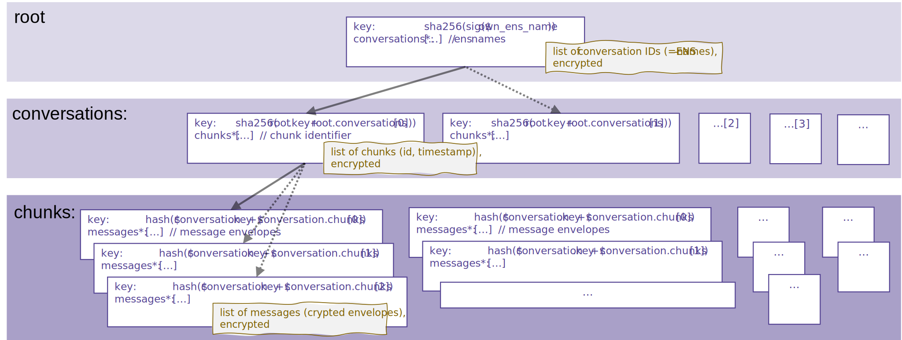

# Data Structure

The conversation data is stored as a data tree grouped by conversations in containers. The structure can be realized as a single file (e.g., export record), as a file store with multiple files (e.g., on local file system, a cloud drive, or in a decentralized storage), or as a database (e.g., as a service).

The data is structured in such a way that fast access with low overhead to specific data is possible, but retrieval of larger data packages is also efficient enough.

## Architecture

The information containers are clustered in 3 types of data:

* **Root:** The root container contains a list of all conversation IDs. A conversation is specified as a collection of messages between 2 users. For each communication partner a conversation is stored. There is exactly one root container per user. The list of conversations is encrypted (with the user's storage encryption key).
* **Conversations:** A conversation container contains a list of chunks, where the actual messages are stored. Each list entry, the chunk identifier, contains the chunk's id and the timestamp of the first message of the chunk. The list of chunks is encrypted (with the user's storage encryption key).
* **Chunks:** Each chunk container holds a list of messages. Those messages are sorted by timestamp. Each chunk can contain a different number of messages. The number is determined by the absolute size of the chunk. Chunks are encrypted (with the user's storage encryption key).
  


### Root Container

The **name** of the `root` container is defined as SHA-256 hash of the signature of the user's ENS-name (represented by `$own_ens_name`).

``` TypeScript
name = sha256( signature( $own_ens_name ))
```

This might be the file name, database identifier, or the section name of a file.

The **conversations** list is the list of ENS-names of the conversation contacts. These are ENS domains or ENS subdomains with **dm3** profile (see [registry](../message-transport/mtp-registry.md)).

``` TypeScript
DEFINITION: Root Container

{
    conversations: string[]
}
```

This list is encrypted with the user's storage encryption key.

> **Example:** (unencrypted)
>
> ``` TypeScript
> {
>    "conversations":  
>    [
>       "friend1.ens",
>       "0x123..abc.addr.dm3.eth" 
>    ]
>}
> ```

### Conversation Container

The **name** of a `conversations` container is defined as SHA-256 hash of the combination of the name of the root container `root.name` and the communication partner's ENS-name, which is listed in the `root` container's conversations list (represented by `root.conversations[$index]` at the `$index` of the list).

``` TypeScript
name = hash( root.name + root.conversations[$index] )
```

For the same conversation partner, only 1 conversation can exist. A conversation must have at least 1 chunk with 1 message. Empty conversations are not stored.

A reference to a chunk is described by an identifier (incrementing, starting with 0) and the timestamp (unix time in milliseconds) of the first message in that chunk.

_**Note:** The timestamp can be used to find messages from a certain time period more easily without having to scann through all chunks._

``` TypeScript
DEFINITION: Chunk Identifier

{
    // the chunk identifier, starting with 0
    id:   number,
    // timestamp of the first message in a chunk
    timestamp: number
}
```

The **chunks** list is the list of chunk identifiers describing the existig chunks. As chunks and messages are sorted in time, the last chunk in the list is the newest one and used to add a new message.

``` TypeScript
DEFINITION: Conversations Container

{
    name: string,
    chunks: ChunkIdentifier[]
}
```

This list is encrypted with the user's storage encryption key.

> **Example:** (unencrypted)
>
> ``` TypeScript
> {
>    "name": "148df0e13b9a...131cade1",
>    "chunks":  
>    [
>       { "id": 0, "timestamp": 16759549450000 },
>       { "id": 1, "timestamp": 16762446650000 }
>    ]
>}
> ```

### Chunk Container

The **name** of a `chunks` container is defined as SHA-256 hash of the combination of the name of the conversations container `$conversation.name` and the chunk identifier, which is listed in the conversation's container's chunks list (represented by `$conversation` as the current conversations container and the chunk identifier `$conversation.chunks[$index]` at the `$index` of the list).

``` TypeScript
name = sha256( $conversation.name + $conversation.chunks[$index] )
```

The **messages** list contains the envelopes (see [Encryption Envelope Structure](../message-transport/mtp-transport.md#encryption-envelope-data-structure)) including the message. However, the fields encrypted during transmission are decrypted. The entire chunks container is subsequently encrypted with the storage encryption key.

``` TypeScript
DEFINITION: Chunk Container

{
    messages: Envelope[]
}
```

The size of the chunks is defined by the maximum size. The maximum size is defined by the client.

**Recomentation:**

* minimum: 500kB,
* maximum: 10MB.

A chunk must contain at least one message. Empty chunks are not created.

_**Note:** The envelope with the message contains encrypted content during transmission (end-to-end encryption). The decrypted information is used for storage so that the sender's public key is not required again to decrypt the data for future use._

The messages list is encrypted with the user's storage encryption key.

> **Example:** (unencrypted)
>
> ``` TypeScript
> {
>    "messages":  
>    [
>       { "message": {...}, "metadata": {...}, ...},
>       { "message": {...}, "metadata": {...}, ...}
>    ]
>}
> ```
