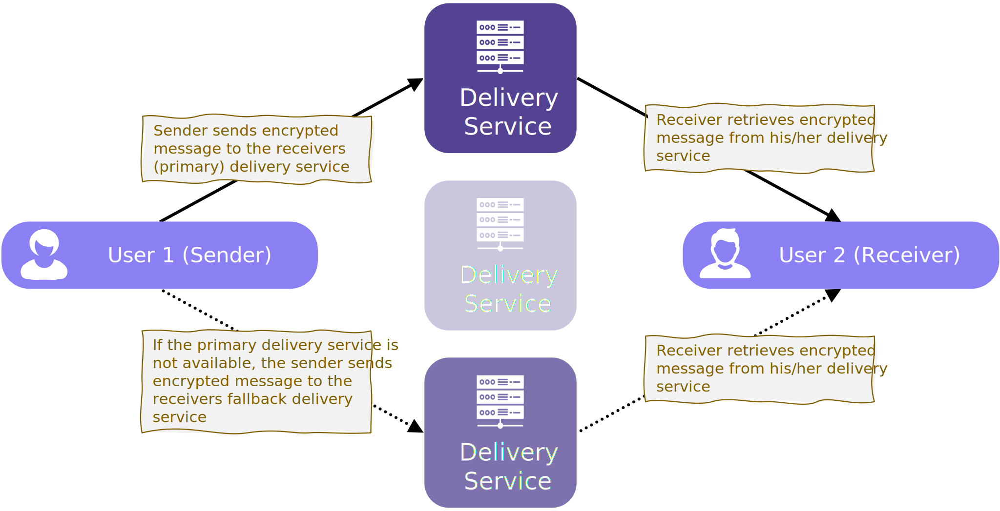
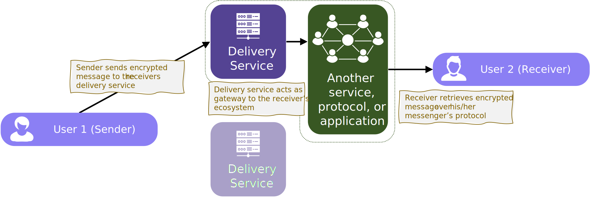

# Appendix

## Delivery Service

A Delivery Service is an RPC endpoint where a client can deliver its message (see [API](mtp-deliveryservice-api.md)).

The delivery service

1. checks whether the message satisfies the recipient's spam policy (see [mutableProfileExtension](mtp-registry.md#user_profile)).
2. decrypts the envelope, adds a postmark, and stores the message encrypted for the recipient until the recipient picks it up.
3. if supported, notifies the receiver that there is a new message.

Delivery service nodes can be operated as a service or self-sovereign by the user. The protocol explicitly allows (see [user profile](mtp-registry.md#user-profile)) for a user to point to multiple delivery services, so that if one is not available, another can be used. However, delivery service nodes can also act as gateways to other protocols, services or applications.

### Gateway to other service

If a delivery service works as a gateway to another protocol or service, it must implement the [API](mtp-deliveryservice-api.md) to receive dm3 messages. However, how it then processes the messages and delivers them to the ecosystem to which it is acting as a gateway is completely up to it and depends only on the service or protocol to which it is connecting.

